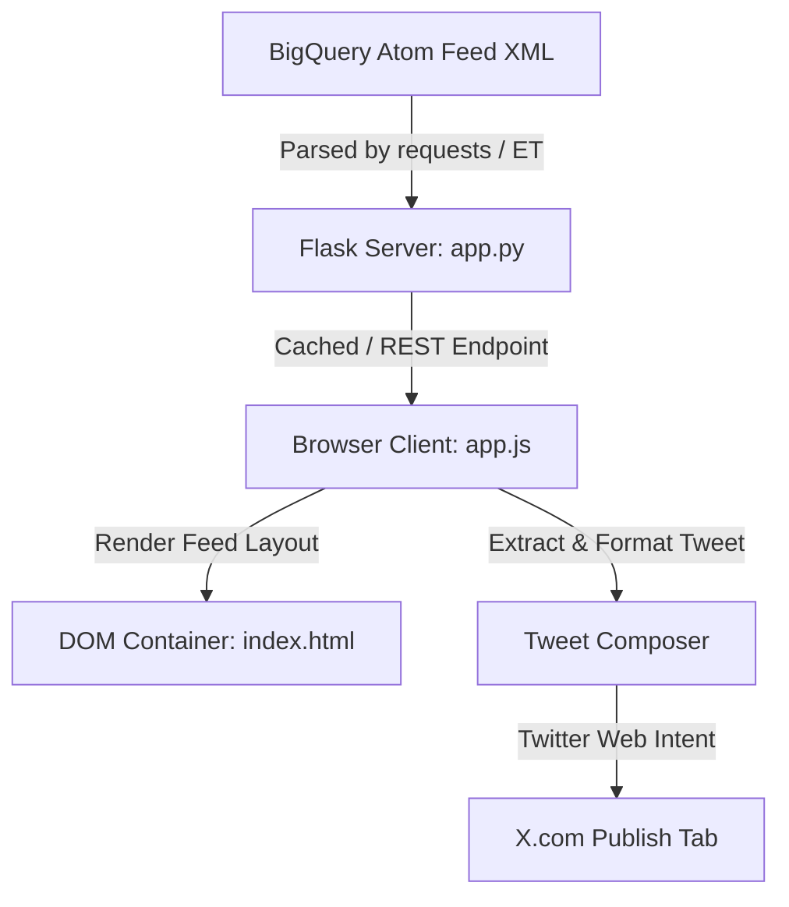

# BigQuery Release Notes Web App - Implementation Plan

This document outlines the architecture, setup, and features of the **BigQuery Release Notes & Twitter Hub** web application.

---

## 🏗️ Architecture Overview

The application is built using a **Python Flask** backend and a **Vanilla HTML, JS, and CSS** frontend, served as a Single Page Application (SPA).



---

## 📁 Project Structure

The project files are organized as follows:

- **`app.py`**: Flask server containing the XML parser and the cached REST endpoint `/api/releases`.
- **`templates/index.html`**: Structured semantic markup containing the feed panel and the tweet composer.
- **`static/css/style.css`**: Design tokens, variables, responsive grid, category badging, and micro-animations.
- **`static/js/app.js`**: Fetches the API data, handles text search and dropdown category filtering, computes tweet formatting, character limits, and routes to X.com.
- **`requirements.txt`**: Declares dependencies (`Flask`, `requests`).

---

## ⚙️ Key Technical Features

### 1. Robust XML Feed Parsing
In `app.py`, the Atom feed from `https://docs.cloud.google.com/feeds/bigquery-release-notes.xml` is processed using python's built-in `xml.etree.ElementTree`. 
HTML CDATA blocks containing multiple updates are split using a regular expression that detects type headers (`<h3>Type</h3>`), organizing them into separate categorized cards (e.g. *Feature*, *Announcement*, *Deprecation*, *Issue*).

### 2. Auto-composed Tweets with Smart Truncation
In `app.js`, selecting a card extracts plain text from the HTML, prepares a custom tweet template (with hashtags `#GoogleCloud #BigQuery` and the anchor link to the exact update), and automatically truncates the update text with `...` if it exceeds the 280-character limit.

### 3. Circular Character Progress Ring
An interactive SVG circular progress indicator dynamically tracks text length. If the text goes over the 280-character limit, the stroke shifts from blue to red and the tweet button is disabled.

---

## 🚀 Execution & Testing

### Installation & Virtual Environment
1. Setup virtual environment:
   ```bash
   python3 -m venv .venv
   ```
2. Install dependencies:
   ```bash
   .venv/bin/pip install -r requirements.txt
   ```

### Running the App
1. Start the Flask dev server:
   ```bash
   .venv/bin/python app.py
   ```
2. Open **`http://127.0.0.1:5000/`** in your browser.
